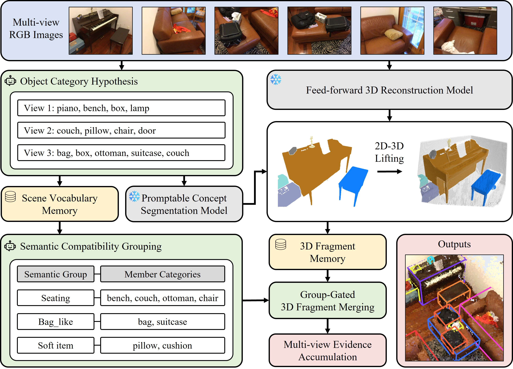

<h1>Group3D</h1>
<h4>MLLM-Driven Semantic Grouping for Open-Vocabulary 3D Object Detection</h4>
<a href="https://github.com/Ubin108">Youbin Kim</a>1  · 
<a href="https://github.com/zinosii">Jinho Park</a>1  · 
<a href="https://hogunpark.com/">Hogun Park</a>1  · 
<a href="https://silverbottlep.github.io">Eunbyung Park</a>2
  
1 Sungkyunkwan University 2 Yonsei University    
 
  

Official github for "**Group3D: MLLM-Driven Semantic Grouping for Open-Vocabulary 3D Object Detection**"

The code will be released soon.